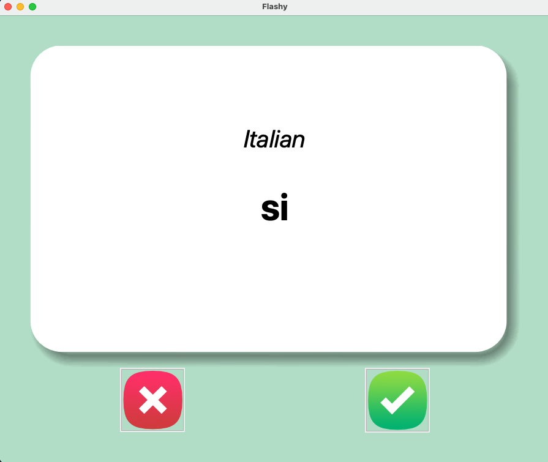
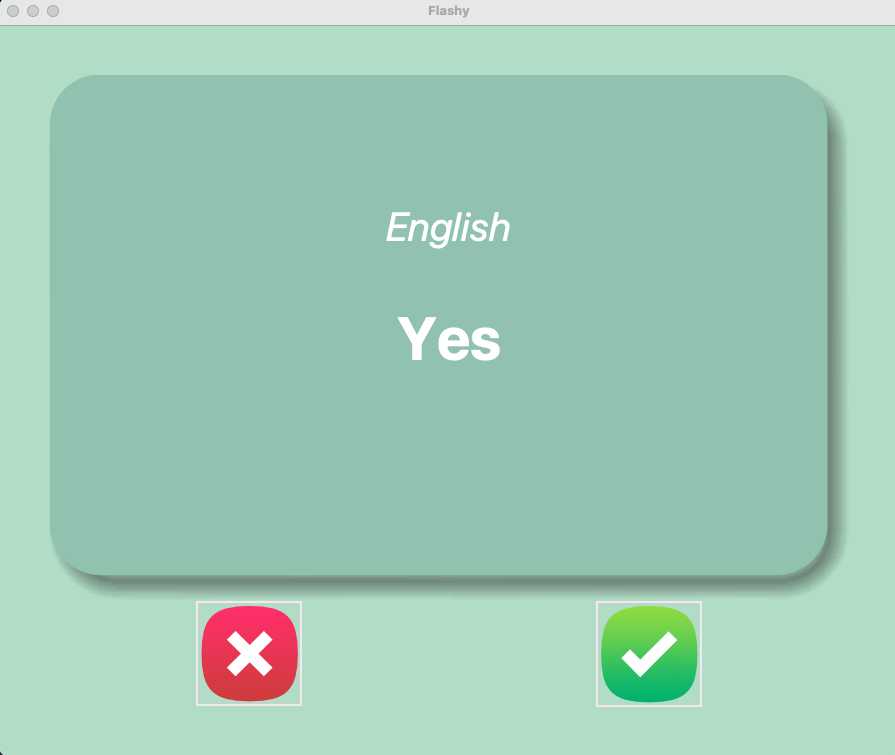

# Learn Italian with me
This is a very useful game where you can work on your skills in learning new words. Currently it is 
implemented with learning Italian.

It can be easily customized based on whatever skill you want to work on, whether its a new langugae, or 
computer programming, politics or General Knowledge.

You get 3 seconds to guess the English translation of the Italian word. If you know the word, click on "Green" tick
button, and it won't quiz you again on that. If you don't know a word, click the "Red" cross button. This will make sure 
to keep it in your words to learn list.

You can view the words you need working on in words_to_learn.csv.

